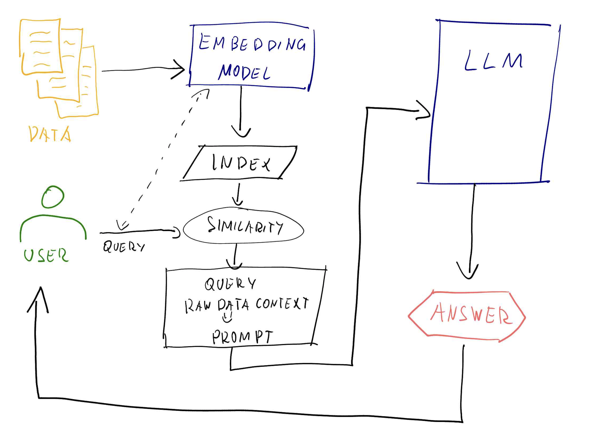

# ts-rag-experiments

Quasi-PoC of RAG application with [FAISS](https://github.com/facebookresearch/faiss) and football [Premier League dataset](https://www.kaggle.com/datasets/pranavkarnani/english-premier-league-match-commentary) from Kaggle.

Prerequisites:

- [Python](https://www.python.org/)
- [Docker](https://www.docker.com/)

Related Medium article: https://medium.com/@stacheratomasz/somebody-call-911-we-need-a-rag-here-hallucinations-llm-and-football-part-1-experiments-21914f5ca2f8

Simplified architecture:

